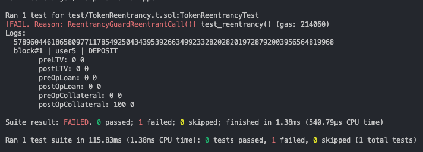

# Upside_Lending_Audit

1. 대상이 되는 컨트랙트들을 src 파일에 추가합니다.
2. 각 파일의 이름은 작성자의 이름으로 대체합니다.
3. 매우 유사한 목적과 구조로 구현된 본 컨트랙트들의 공통적인 핵심 취약점 여부를 정리합니다.
4. 각 컨트랙트의 특징적인 취약점을 정리합니다.

| 심각도        | 기호 | 설명                                                                    |
| ------------- | ---- | ----------------------------------------------------------------------- |
| Critical      | 🔴   | 시스템 전체에 심각한 영향을 미칠 수 있으며, 즉각적인 조치가 필요합니다. |
| High          | 🟠   | 주요 기능에 영향을 미칠 수 있으며, 빠른 해결이 필요합니다.              |
| Medium        | 🟡   | 일부 기능에 영향을 미칠 수 있으며, 조치가 필요합니다.                   |
| Low           | 🟢   | 경미한 문제로, 사용자 경험에 약간의 영향을 미칠 수 있습니다.            |
| Informational | 🔵   | 정보 제공 목적이며, 시스템에 직접적인 영향을 미치지 않습니다.           |

---

# 🟠 Depsoit and Withdraw

> High
> <br>
> 동일한 블록 내에서 동일한 양으로 동일한 종류의 토큰의 입금과 출금을 반복하였으나, 출금 자체가 불가능합니다.
> <br>
> 유동성이 충분히 확보되지 않을 경우, 사용자들의 자산이 컨트랙트에 동결될 수 있으므로 빠른 수정이 필요합니다.

- [require(accounts[msg.sender] >= tokenAmount, "your balance lower than etherAmount");](https://github.com/ooMia/Upside_Lending_Audit/blob/31cf9013883c5b59dbaa4e7eb3d25d9a1481468c/src/WOOSIK-jeremy.sol#L81)

```ts
function withdraw(address token, uint256 tokenAmount) public payable {
    if (block.number - borrowBlock[msg.sender] > 0 && borrowBlock[msg.sender] > 0) {
        for (uint256 i = 0; i < (block.number - borrowBlock[msg.sender]); i++) {
            accounts[msg.sender] = accounts[msg.sender] * 1999 / 2000;
        }
    }

    require(accounts[msg.sender] >= tokenAmount, "your balance lower than etherAmount"); // #L81
    // ...
```

문제가 된 81번째 줄의 검증 자체는 사용자가 적절한 양의 토큰을 전송하였는지 확인하는 정상적인 로직입니다. 하지만 `accounts[msg.sender]` 값을 확인해보니 0이었고, 입금이 제대로 처리되지 않았다는 것을 확인할 수 있었습니다.

```ts
function deposit(address token, uint256 tokenAmount) public payable {
    if (token == address(0x00)) {
        // ...
    } else {
        uint256 allow = usdc.allowance(msg.sender, address(this));
        require(allow >= tokenAmount, "your token lower than deposit token");
        usdc.transferFrom(msg.sender, address(this), tokenAmount);
        tokenAccount[msg.sender] += tokenAmount;
    }
```

최종적으로 파악한 원인은 `deposit` 함수에서 Native Token과 ERC20 토큰을 별도의 상태 변수로 구분하여 관리하기 때문으로 확인되었습니다. 아마 `withdraw` 함수에서 사용자에게 인출을 지원할 때, 반드시 Native Token을 사용하도록 강제하고 있기 때문에 발생한 문제로 보입니다.

### Severity: 🟠 High

컨트랙트 내 Native Token 공급이 충분하지 않을 경우, 사용자들의 ERC20 토큰 자산이 컨트랙트에 동결되는 결과를 초래할 수 있습니다. 동일 블록 내에서 ERC20 토큰으로 입금하였다면, 동일한 양의 ERC20 토큰으로 인출이 가능하도록 수정을 제안합니다.

### Solution

1. 입금된 형태의 자산을 기록하고, 출금 시에도 동일한 형태의 자산을 사용하도록 수정합니다.
2. 컨트랙트 내 자산의 비율을 고려하여, 동일한 가치를 지니는 복합 형태의 자산으로 출금을 지원합니다.
3. Native Token으로의 출금을 강제해야 한다면, 입금 시 인출 가능한 Native Token의 양을 확인하여 입금을 제한합니다.

---

# 🟠 Depsoit and Withdraw (2)

> High
> <br>
> 동일한 블록 내에서 동일한 양으로 동일한 종류의 토큰의 입금과 출금을 반복하였으나, 출금 자체가 불가능합니다.
> <br>
> 유동성이 충분히 확보되지 않을 경우, 사용자들의 자산이 컨트랙트에 동결될 수 있으므로 빠른 수정이 필요합니다.

- [gloomydumber.sol](src/gloomydumber.sol)
- [gdh8230.sol](src/gdh8230.sol)

---

# 🟠 Arithmetic underflow or overflow

> Medium
> <br>
> 다수의 컨트랙트에서 발견되는 이 현상은, 큰 값을 가진 블록 높이에 대해 거듭제곱 연산을 수행하며 발생하는 오버플로우와 언더플로우로 인해 컨트랙트 가용성이 저해되는 문제입니다. 특정 블록 높이 이후로는 컨트랙트 내의 자금이 동결될 수 있으므로, 사용자들에게 이 점을 고지하고 빠르게 수정할 필요가 있습니다.

- [kaymin128.sol](src/kaymin128.sol)
- [Entropy1110.sol](src/Entropy1110.sol)
- [dokpark21.sol](src/dokpark21.sol)

---

# 🟡 Gas limit

> Medium
> <br>
> 다수의 컨트랙트에서 발견되는 이 현상은, 블록의 수가 커질수록 내부 거듭제곱 연산에 의해 지나치게 많은 가스비가 소모되는 문제입니다.

- [rivercastleone.sol](src/rivercastleone.sol)
- [GODMuang.sol](src/GODMuang.sol)
- [gdh8230.sol](src/gdh8230.sol)
- [choihs0457.sol](src/choihs0457.sol)
- [55hnnn.sol](src/55hnnn.sol)
- [0xGh-st.sol](src/0xGh-st.sol)

### Solution

- 컨트랙트 내 거듭제곱 연산을 최적화하여, 블록의 수가 증가해도 가스비가 증가하지 않도록 합니다.

### Solution

- 고정 소수점 라이브러리를 사용하여, 오버플로우와 언더플로우를 방지합니다.

---

# 🔵 Reentrancy

> Informational
> <br>
> 생성자에서 토큰의 주소를 받아 컨트랙트를 생성하는데, 토큰 설계에 따라 함수 재정의 또는 fallback을 통해 컨트랙트 재진입이 가능합니다.
> <br>
> 컨트랙트 내 상태 변화보다 자산의 이동이 선행되는 경우, 재진입 공격의 피해를 입을 수 있습니다.

[TokenReentrancy.sol](test/TokenReentrancy.t.sol)

- 이 공격은 단순하여 모든 컨트랙트에 대해 달성되지 않았습니다.
- 하지만 대부분의 컨트렉트가 재진입을 허용하고 있기에 취약점이 발견되면 악용될 여지가 있습니다.

### Solution

- Check-Effects-Interactions 패턴을 사용하여 상태 변경 후 자산 이동을 수행합니다.
- ReentrancyGuard 라이브러리를 사용하여 재진입 공격을 방어합니다.
  
- 함수 실행 이전/이후로 트랜잭션 결과에 대한 검증을 수행하여, 이상 거래를 방지합니다.
